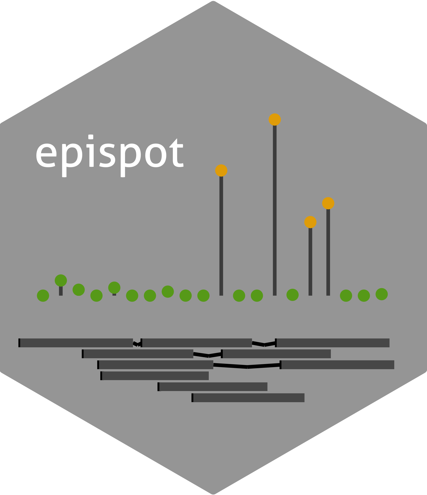

---
output:
  md_document:
    variant: gfm
html_preview: false
---

<!-- README.md is generated from README.Rmd. Please edit that file -->
<!-- First time: run usethis::use_readme_rmd() to create a pre-commit hook that 
prevents from committing if the README.Rmd has changed, but has not been 
re-knitted to generate an updated README.md -->

```{r, include = FALSE}
knitr::opts_chunk$set(
  collapse = TRUE,
  comment = "#>",
  fig.path = "man/figures/README-",
  out.width = "100%"
)
```


```{r echo=FALSE, results="hide", message=FALSE}
require(badger)
```


## EPISPOT – Annotation-driven approach for large-scale joint regression with multiple responses 

<!-- Run for the R CMD checks, run usethis::use_github_actions() to set up the pipeline, possibly modify the .yaml file and then: -->
`r badge_travis("hruffieux/epispot")`
`r badge_github_actions("hruffieux/epispot")` 
`r badge_license("GPL v3", url = "https://www.gnu.org/licenses/gpl-3.0")`
`r badge_devel("hruffieux/epispot", "blue")`
`r badge_code_size("hruffieux/epispot")`
`r badge_doi("10.1101/2020.09.21.305789", "yellow")`

## Overview

**epispot** is an R package for parallel variational expectation-maximisation in 
sparse regression with hierarchically-related responses and predictor-level 
information. A notable application is in the context of molecular quantitative 
trait locus mapping, with several thousand molecular levels (responses), genetic 
markers (candidate predictors) and epigenetic annotation marks (predictor-level 
covariates) and individuals (samples).

H. Ruffieux, B. Fairfax, I. Nassiri, E. Vigorito, C. Wallace, S. Richardson, L. Bottolo. EPISPOT : An epigenome-driven approach for detecting and interpreting hotspots in molecular QTL studies, *The American Journal of Human Genetics*, 108:1-18, 10.1016/j.ajhg.2021.04.010, 2021. 

## Installation

To install, run the following commands in R:

``` r
if(!require(remotes)) install.packages("remotes")
remotes::install_github("hruffieux/epispot")
```

## License and authors

This software uses the GPL v3 license, see [LICENSE](LICENSE).
Authors and copyright are provided in [DESCRIPTION](DESCRIPTION). 

## Issues

To report an issue, please use the 
[epispot issue tracker](https://github.com/hruffieux/epispot/issues) at 
github.com.